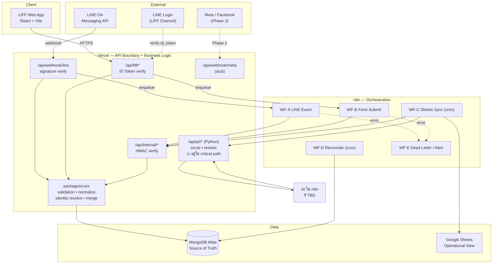
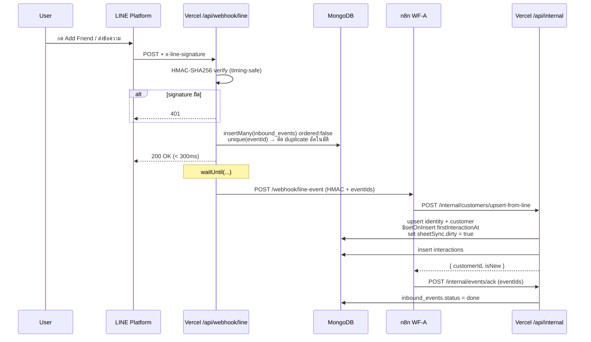
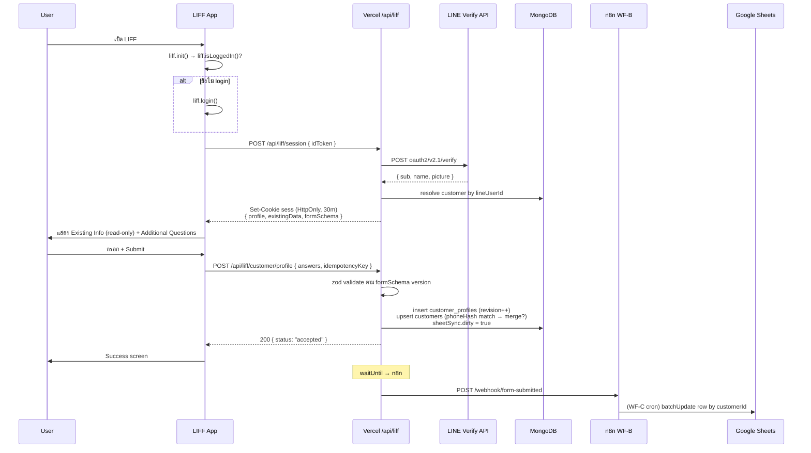
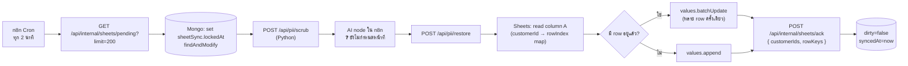
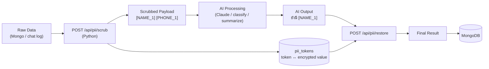

# Phase 1 — System Architecture

## 1.1 หลักการที่ใช้ตัดสินใจ

1. **Vercel = Boundary + Brain** — ทุก input จากภายนอกเข้าผ่าน Vercel เท่านั้น, business rule อยู่ที่นี่
2. **n8n = Orchestrator ไม่ใช่ Application** — trigger, routing, retry, integration I/O
3. **MongoDB = Single Source of Truth** — ทุกอย่างที่อื่น derive ได้จากตรงนี้
4. **Google Sheets = Read Model** — ลบทิ้งแล้วสร้างใหม่จาก Mongo ได้เสมอ
5. **ทุก write เป็น Idempotent** — มี key ที่ทำให้ทำซ้ำแล้วผลเหมือนเดิม

---

## 1.2 Component Diagram

---

## 1.3 Responsibility Matrix

| Component | รับผิดชอบ | **ห้าม**ทำ |
|---|---|---|
| **LIFF Frontend** | render form, LINE Login, ส่ง `id_token` | ตัดสินใจ business rule, เชื่อ userId ตัวเอง, ยิง n8n ตรง |
| **Vercel `/api/webhook/*`** | verify signature, idempotent enqueue, ack เร็ว | ประมวลผลหนัก, เขียน customer ตรง |
| **Vercel `/api/liff/*`** | verify id_token, ออก session, อ่าน/เขียน profile ของ **เจ้าตัวเท่านั้น** | trust request body สำหรับ identity |
| **Vercel `/api/internal/*`** | จุดเดียวที่ n8n เขียนข้อมูลได้, HMAC-protected | เปิด public |
| **packages/core** | zod validation, normalize phone/email, identity resolution, merge, dirty-flag | ผูกกับ HTTP framework (ต้อง unit-test ได้เปล่า ๆ) |
| **n8n** | trigger, retry, fan-out, Sheets I/O, alert, cron | ถือ business rule, ต่อ Mongo write ตรง |
| **MongoDB** | source of truth, unique constraint, audit | เก็บ PII plaintext ใน indexed field |
| **Google Sheets** | ให้พนักงานอ่าน/กรอง | เป็นที่ที่ระบบอ่านกลับมาใช้ตัดสินใจ |
| **PII Service (Python)** | scrub / restore / token vault | เก็บ token map ไว้ใน memory อย่างเดียว |

---

## 1.4 Data Flow A — LINE Event (Follow / Message)

**จุดสำคัญ:** ถ้า n8n ล่ม → `inbound_events` ยังเป็น `pending` → WF-D (reconciler) กวาดมาทำใหม่ภายใน 1 นาที **ไม่มี event หาย**

---

## 1.5 Data Flow B — LIFF Form Submission

**ทำไม Vercel เขียน Mongo เองไม่รอ n8n:** ผู้ใช้ต้องเห็นผลลัพธ์ทันที และการเขียน source of truth ไม่ควรขึ้นกับความพร้อมของ n8n
**n8n ทำอะไร:** side-effect ที่ช้าและล้มเหลวได้ — Sheets, แจ้งเตือน, enrichment ในอนาคต

---

## 1.6 Data Flow C — Google Sheets Sync (Batch)

**Privacy Layer:** AI เห็นแค่ placeholder (`<PERSON_7c21>`, `<TH_PHONE_a3f9>`) ไม่เคยเห็นข้อมูลจริง
ตรงตาม pipeline ในโจทย์ `Raw Data → Scrubber → AI Processing → Restore / Mapping → Database`

**Idempotency:** ถ้า ack ไม่ถึง → รอบหน้า sync ซ้ำ → เขียนทับ row เดิม (ค่าเท่ากัน) = ปลอดภัย

---

## 1.7 Data Flow D — Privacy / AI Pipeline (เตรียมไว้ ยังไม่ build)

**บังคับด้วย code ไม่ใช่ด้วยวินัย:** AI client ถูก wrap ไว้ที่ `packages/ai/client.ts` ซึ่ง **require argument `scrubReceipt`** — เรียก AI โดยไม่ผ่าน scrubber จะ compile ไม่ผ่าน

---

## 1.8 API Boundary (ใครเรียกใครได้บ้าง)

| Zone | Auth Mechanism | ผู้เรียกที่อนุญาต |
|---|---|---|
| `/api/webhook/line` | `x-line-signature` HMAC-SHA256 (channel secret) | LINE Platform |
| `/api/webhook/meta` | `x-hub-signature-256` + verify_token | Meta |
| `/api/webhook/n8n` | `x-n8n-signature` HMAC + timestamp (กัน replay ±5 นาที) | n8n |
| `/api/liff/*` | LINE ID Token → session cookie | LIFF frontend เท่านั้น (CORS ล็อก origin) |
| `/api/internal/*` | HMAC shared secret + IP allowlist (ถ้ามี static IP) | n8n, cron |
| `/api/pii/*` | HMAC internal | Vercel core, n8n |

**หลักการ:** ไม่มี endpoint ไหนที่เชื่อ identity จาก request body — identity มาจาก **cryptographic proof** เสมอ

---

## 1.9 Alternative Architecture ที่พิจารณาแล้วไม่เลือก

| ทางเลือก | ทำไมไม่เลือก |
|---|---|
| **LINE webhook → n8n ตรง ๆ** | n8n verify LINE signature ได้ยาก/เปราะ, n8n ล่ม = event หาย, ผูก vendor แน่น, debug ยาก |
| **n8n ต่อ MongoDB node โดยตรง** | business rule กระจายไปอยู่ใน UI ที่ test ไม่ได้ (ขัดข้อกำหนดในโจทย์) |
| **ไม่มี n8n เลย ทำใน Vercel หมด** | เสียประโยชน์ integration สำเร็จรูป (Sheets/Meta/Slack) + ทีม non-dev แก้ flow ไม่ได้ |
| **Sheets เป็น database** | ไม่มี transaction/index/unique, quota ต่ำ, พังตอน concurrent |
| **Postgres แทน Mongo** | schema ยืดหยุ่นน้อยกว่าสำหรับ form ที่คำถามเปลี่ยนบ่อย + โจทย์ระบุ Mongo |
| **Realtime Sheets sync ทุก event** | ชน quota + duplicate row (RISK-4) |
